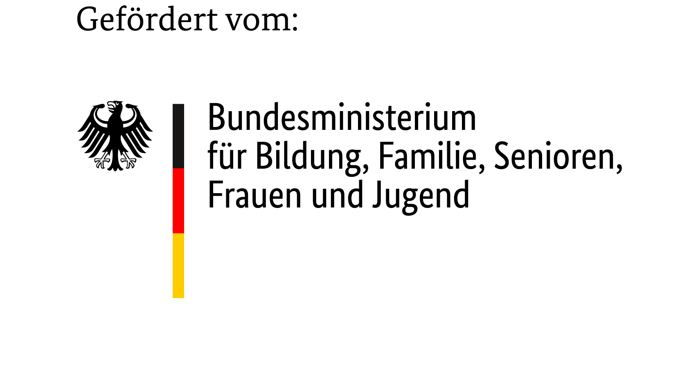
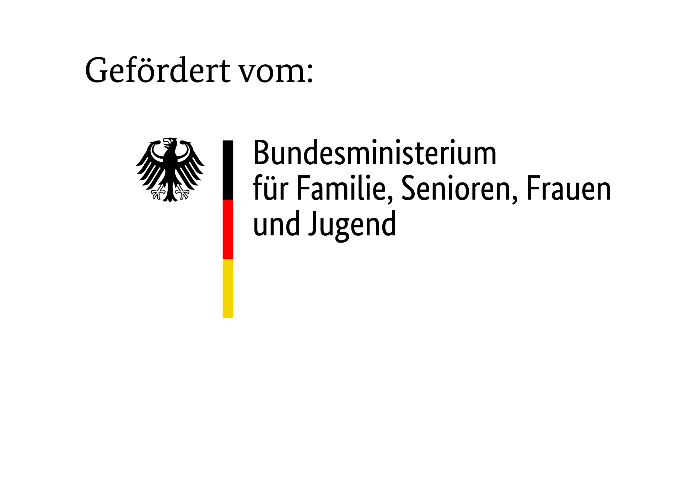

# Contracts

## Downloading contract files

The membership_contract custom field in membership_general custom group can hold
a contract reference. This contract reference is matched to a file located in:
`sites/default/files/civicrm/custom/contracts/{reference}.tif`

If the file does not exist, it will not be available for download and the
contract reference will not be shown as a link.

## Configuration

You must create a directory or symlink in CiviCRM customFilesUploadDir
"contracts". eg. `sites/default/files/civicrm/custom/contracts` for Drupal
environments.

## Customisation

To allow customisation to your organisation, the contract extension currently offers
the following Symfony events:

| event name                                     | purpose                                                                                                                                   | since version |
|------------------------------------------------|-------------------------------------------------------------------------------------------------------------------------------------------|---------------|
| ``de.contract.rapidcreateform``                | Supply an optimised "rapid create" form, that let's you efficiently register new members, i.e. creates a new contact and a new membership | 1.5           |
| ``de.contract.renderchangedisplay``            | Render custom titles for displaying change activities in the review section of the contracts                                              | 1.5           |
| ``de.contract.renderchangesubject``            | Render custom subject lines for the contract change activities                                                                            | 1.5           |
| ``de.contract.eligible_campaigns``             | Define the eligible campaigns for a contract                                                                                              | 1.5           |
| ``de.contract.suppress_system_activity_types`` | Change the list of (automatically generated) acitivies to be suppressed                                                                   | 1.5           |
| ``de.contract.contractreview.adjust``          | Adjust the contract review section of in the membership tab                                                                               | 1.5           |
| ``de.contract.form.defaults``                  | Adjust default values in the contract create/modify/cancel screens                                                                        | 1.5           |

more to come...

## Förderhinweis / Funding Acknowledgement

Diese Weiterentwicklung von CiviCRM wurde durch vom **AWO Bundesverband e.V.** beauftragt und durch die **SYSTOPIA GmbH** entwickelt. Besonderer Dank gilt dem Förderprogramm **„Zukunftssicherung der Freien Wohlfahrtspflege durch Digitalisierung“** des **Bundesministeriums für Bildung, Familie, Senioren und Jugend**.

This extension of CiviCRM was commissioned by the **AWO Bundesverband e.V. (Federal Association of Workers' Welfare)** and developed by **SYSTOPIA GmbH**. Special thanks go to the funding program **“Securing the Future of Independent Welfare Services through Digitization”** of the **Federal Ministry for Family Affairs, Senior Citizens, Women and Youth**.

### Für Entwicklungen 2024 bis Mai 2025 (alter Ministeriums Zuschnitt)

Diese Weiterentwicklung von CiviCRM wurde im Auftrag des **AWO Bundesverbandes e. V.** von der **SYSTOPIA GmbH** entwickelt. Unser besonderer Dank gilt dem Förderprogramm **„Zukunftssicherung der Freien Wohlfahrtspflege durch Digitalisierung“** des **Bundesministeriums für Familie, Senioren, Frauen und Jugend**, das die Entwicklungen ermöglicht hat.

This extension of CiviCRM was developed by **SYSTOPIA GmbH** on behalf of the **AWO Bundesverband e. V. (AWO Federal Association)**. We would like to express our special thanks to the **Federal Ministry for Family Affairs, Senior Citizens, Women and Youth** for its funding program **“Securing the Future of Independent Welfare Services through Digitalization,”** which made these developments possible.

### Logos

